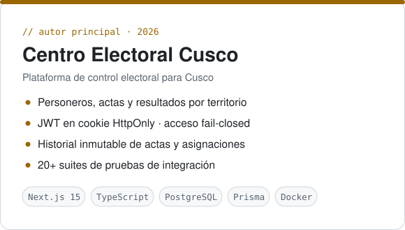
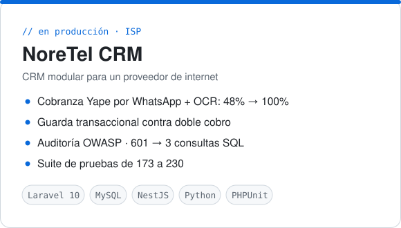

<picture>
  <source media="(prefers-color-scheme: dark)" srcset="assets/banner-dark.svg">
  
</picture>

Construyo **sistemas que están en producción** y me importa poder demostrar que funcionan: datos que no se corrompen, accesos que fallan de forma segura y cambios respaldados por pruebas. Egresado de Ingeniería Informática y de Sistemas en la **UNSAAC**.

**Ahora mismo:** desarrollo el *Centro Electoral Cusco*, una plataforma para el control de personeros, actas y resultados.

## Proyectos

<table>
  <tr>
    <td width="50%">
      <picture>
        <source media="(prefers-color-scheme: dark)" srcset="assets/card-electoral-dark.svg">
        
      </picture>
    </td>
    <td width="50%">
      <picture>
        <source media="(prefers-color-scheme: dark)" srcset="assets/card-noretel-dark.svg">
        
      </picture>
    </td>
  </tr>
</table>

<details>
<summary><b>Qué resolví en cada uno</b></summary>
<br>

**Centro Electoral Cusco** — Coordinar personeros en toda una región exige saber, en todo momento, quién cubre cada mesa y qué acta es la vigente. Modelé el acceso por rol *y* por territorio (región, provincia, distrito) de modo que un coordinador sin alcance válido no vea nada, y diseñé el historial de actas y asignaciones para que nunca se borre: una corrección crea una versión nueva.

**NoreTel CRM** — La empresa validaba a mano cada captura de pago que llegaba por WhatsApp. Integré una pasarela de mensajería, lectura OCR y conciliación contra la notificación bancaria, y medí el resultado: el cierre automático pasó de 48 % a 100 %. Luego blindé la facturación contra el doble cobro con una verificación dentro de la transacción y bloqueo de fila, y cerré una auditoría de seguridad y rendimiento con pruebas que fallaban antes de cada corrección.

<sub>El código de ambos es privado porque son sistemas en uso. Con gusto lo muestro en una entrevista.</sub>
</details>

También colaboré en sistemas web con Laravel 12 para **gestión comunal** (asistencia por QR, caja y actas), **ferretería** (inventario y kardex) y **control de asistencias**.

## Con qué trabajo

| | En producción | Lo uso para |
|---|---|---|
| **Backend** | Laravel · PHP 8 · Node.js · NestJS · Python | servicios, APIs REST, webhooks, integraciones |
| **Frontend** | Next.js · React · TypeScript · Tailwind | paneles administrativos y PWA |
| **Datos** | MySQL · PostgreSQL · Prisma | transacciones, índices, migraciones versionadas |
| **Calidad** | PHPUnit · pruebas de integración · TDD | demostrar cada cambio antes de entregarlo |
| **Infra** | Docker · Linux · cPanel · Git | despliegue y operación de servicios |

## Cómo trabajo

```text
$ git log --oneline --author="luisTayna" -- principios/
a3f91c2 perf: medir antes de optimizar (601 → 3 consultas, con prueba)
7c04e5d fix(billing): la regla de negocio vive en la transacción, no en la pantalla
2b8d6f1 fix(security): ocultar un botón no protege una ruta
e51a9b0 test: una prueba que nunca falló no demuestra nada
94d7c3e refactor: un solo lugar para cada decisión
```

<p>
  <a href="mailto:luis113654@gmail.com"></a>
  
</p>
